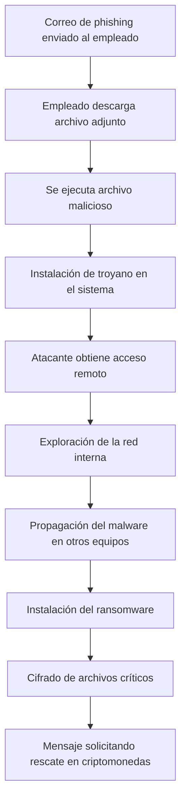

# Flujo del ataque ransomware

El siguiente diagrama muestra de forma simplificada cómo se desarrolla el ataque descrito en el escenario.

```mermaid
flowchart TD

A[Correo de phishing enviado al empleado] --> B[Empleado descarga archivo adjunto]
B --> C[Se ejecuta archivo malicioso]
C --> D[Instalación de troyano en el sistema]

D --> E[Atacante obtiene acceso remoto]
E --> F[Exploración de la red interna]

F --> G[Propagación del malware en otros equipos]
G --> H[Instalación del ransomware]

H --> I[Cifrado de archivos críticos]
I --> J[Mensaje solicitando rescate en criptomonedas]
```
